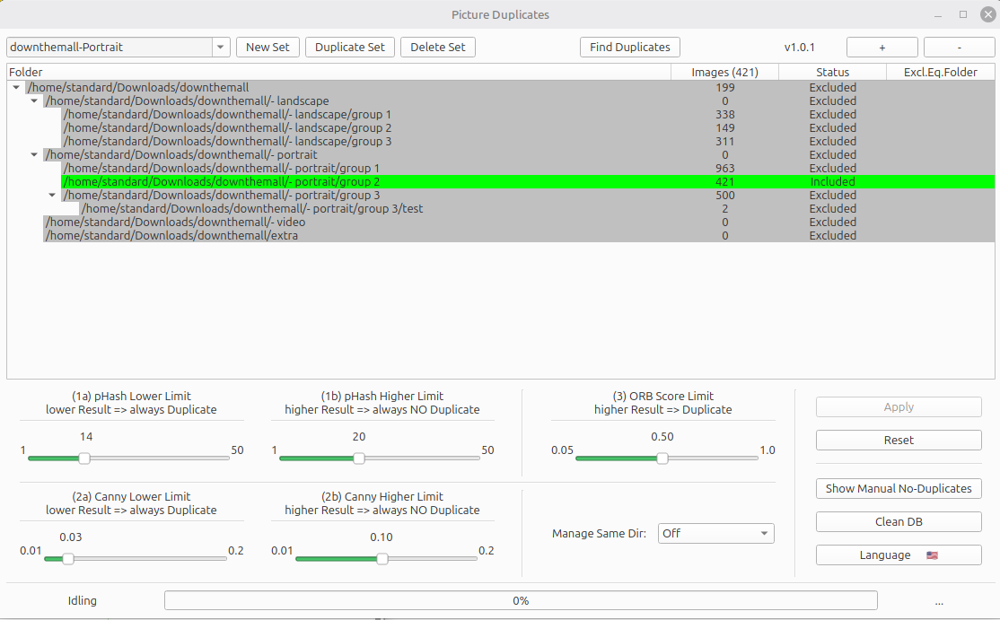

# Picture_Duplicates

Checks pictures of one or more folders to find duplicates.

Überprüft Bilder aus einem oder mehreren Verzeichnissen auf Duplikate.


## Screenshots

### Hauptfenster



## English
See below


## Deutsch
### Funktionen

- Es können mehrere "Sets" von Verzeichnissen angelegt werden.

- Zu jedem "Set" können ein oder mehrere Verzeichnisse hinzugefügt werden. Die Unterverzeichnisse von denen werden automatisch auch hinzugefügt.

- Für jedes Verzeichnis kann ausgewählt werden, ob es
    - eingeschlossen ist.
    - eingeschlossen und ein Referenz-Verzeichnis ist.
    - ausgeschlossen ist.

- Zudem kann pro Verzeichnis ausgewählt werden, ob innerhalb des Verzeichnisses nach Duplikaten gesucht wird (beide Dateien sind im selben Verzeichnis).

- Auch für alle Ordner kann generell ausgewählt werden (dann gelten nicht die individuelle Einstellung siehe die Zeile über dieser)
    - Generell keine Duplikats-Sucher im selben Verzeichnis
    - Nur Duplikats-Sucher im selben Verzeichnis

- Zur Duplikatssuche werden bis zu drei Verfahren angewandt. Für jedes Verfahren können Grenzen gesetzt werden.
     1. pHash - Abstand     (unterhalb einer Grenze: Immer ein Duplikat, oberhalb einer Grenze: Niemals ein Duplikat)
     2. canny - Unterschied (unterhalb einer Grenze: Immer ein Duplikat, oberhalb einer Grenze: Niemals ein Duplikat)
     3. ORB   - Unterschied (oberhalb einer Grenze: ein Duplikat)
  Wenn ein Verfahren bereits ein eindeutiges Ergebnis liefert, wird kein weiteres Verfahren mehr verwendet. Dadurch wird viel Rechenleistung gespart.
  pHash geht am schnellsten, canny bereits etwas langsamer und ORB ist sehr rechenintensiv.

- Zur weiteren Beschleunigung werden pHash, canny und ORB Werte von jedem Bild, das schon einmal analysiert wurde, in einer Datenbank gespeichert.
  Auch ORB Differenten werden in der Datenbank gespeichert, weil sie sonst immer sehr zeitaufwendig neu berechnet werden müssten.

- Diese Datenbank lässt sich bereinigen, falls inzwischen viele Bilder gelöscht wurden.

- Das Programm versucht auf mehreren Wegen eine Bilddatei in der Datenbank zu finden:
     - Vollständiger Datei-Pfad  (Dateigröße und Datum der letzten Änderung müssen gleich sein)
     - Nur Dateiname selbst      (Dateigröße und Datum der letzten Änderung müssen gleich sein)
     - Dateiname ohne einen [...] Prefix (Dateigröße und Datum der letzten Änderung müssen gleich sein)
  Nur wenn so keine Dateiinformationen in der Datenbank gefunden werden, wird das Bild als unbekannt gewertet und die Werte berechnet.
  Das Programm erkennt so auch, on eine Datei inzwischen in einem anderen Ordner ist und speichert den neuen Pfad in der Datenbank ab.

- Nach dem Finden der Duplikate öffnet sich ein neues Fenster. In dem kann man nun
    - Bilder im Bildbetrachter des Rechners öffnen
    - Bilder löschen (das 'Master' Bild kann nicht gelöscht werden)
    - Bilder vergleichen (über Differenz-Methode bzw. XOR-Methode)
    - Ein Bild zum 'Master'-Bild machen.
    - Manuell angeben, dass ein Vergleichspaar doch keine Duplikate sind (diese Information wird auch in der Datenbank gespeichert).

- Es lassen sich alle manuellen "Kein-Duplikat" -Bilderpaare anzeigen und diese Indikation wieder entfernen.

- Das Suchen nach Duplikaten benötigt mehrere Programm-Schritte. Das Programm zeigt ganz unten den aktuellen Fortschritt an.


### Voraussetzungen

- Qt 6.11 oder höher
- CMake 3.16 oder höher
- OpenCV 5.x
- Ein C++-Compiler


### OpenCV

Das Projekt benötigt **OpenCV 5.0.0**.

- [OpenCV 5.0.0 herunterladen](https://github.com/opencv/opencv/archive/refs/tags/5.0.0.tar.gz)
- [Offizielle OpenCV-Website](https://opencv.org/)

OpenCV muss auf dem System installiert sein und von CMake gefunden werden können.


### Build

Das Projekt verwendet CMake und Qt.

Zum Bauen kann das Projekt mit **Qt Creator** geöffnet werden:

1. `CMakeLists.txt` in Qt Creator öffnen.
2. Einen passenden Qt/CMake-Kit auswählen.
3. Projekt konfigurieren lassen.
4. Projekt bauen.

Alternativ kann das Projekt auch direkt mit CMake gebaut werden:
   ```bash
   mkdir build
   cd build
   cmake ..
   cmake --build .

   ```

### Flatpak

Die fertige Version ist als Flatpak unter [Releases](../../releases) verfügbar.


### Lizenz

Dieses Projekt steht unter der **GNU General Public License v3.0 or later (GPL-3.0-or-later)**.

Siehe die Datei `LICENSE` für den vollständigen Lizenztext.


## English
### Features

- You can create several "sets" of folders.

- You can add one or more folders to each set. Subfolders are added automatically.

- You can select for each folder, whether to
    - include it.
    - use it as reference folder.
    - exclude it.

- You can also select whether duplicates should not be searched for within the same folder (i.e. both files are in the same folder).

- There are three calculation methods for finding duplicates. For each method, you can define thresholds:
   - Do not search for duplicates within the same folder.
   - Only search for duplicates within the same folder.

- There are three calculation methods for finding duplicates. For each method, you can define thresholds:
     1. **pHash – distance** (below the threshold: Always a duplicate, above the threshold: Never a duplicate)
     2. **canny - difference** (below the threshold: Always a duplicate, above the threshold: Never a duplicate)
     3. **ORB - difference** (above the threshold: a duplicate)

  If a calculation method already produces a clear result, no other method is used. This saves a lot of CPU time.
  pHash is the fastest, Canny is somewhat slower, and ORB requires significantly more CPU time.

- To speed up the process even further, the pHash, Canny, and ORB values of every analyzed picture are stored in a database.
  ORB differences are also stored because calculating them requires a lot of CPU time.

- The database can be shrunk if many pictures have been deleted in the meantime.

- The program tries to find picture information in the database
     - Using the complete file path (file size and file date must match).
     - Using the file name only     (file size and file date must match)
     - Using the file name with a `[...]` prefix removed (file size and file date must match).

  Only if no file information is found using these methods, the picture considered as unknown and the required values are calculated.

  The program can also detect when a file has been moved to another folder. In this case, the path information is updated in the database.

- After duplicates have been found, a new window is displayed. Here you can
    - open a picture in the default picture viewer of your PC.
    - delete a picture (the 'master' picture cannot be deleted)
    - compare pictures (using difference and XOR methods)
    - change a picture to 'master'
    - manually define a picture pair as not being duplicates.

- You can display a list of all "No Duplicate" pairs and remove this indicator if needed.

- The duplicate search consists of multiple processing steps. The program displays the progress at the bottom of the main window.


### Requirements

- Qt 6.11 or higher
- CMake 3.16 or higher
- OpenCV 5.x
- A C++-Compiler


### OpenCV

The project needs **OpenCV 5.0.0**.

- [Download OpenCV 5.0.0](https://github.com/opencv/opencv/archive/refs/tags/5.0.0.tar.gz)
- [Official OpenCV-Website](https://opencv.org/)

OpenCV must be installed on the system and must be discoverable by CMake.


## Build

The project uses CMake and Qt.

To build the project, it can be opened in **Qt Creator**:

1. Open `CMakeLists.txt` in Qt Creator.
2. Select a suitable Qt/CMake kit.
3. Let Qt Creator configure the project.
4. Build the project.

Alternatively, the projekt can be built directly with CMake:
   ```bash
   mkdir build
   cd build
   cmake ..
   cmake --build .

   ```

## Flatpak

A Flatpak version is available here: [Releases](../../releases)


## License

This project uses the **GNU General Public License v3.0 or later (GPL-3.0-or-later)**.

See the file `LICENSE` for the complete license text.


